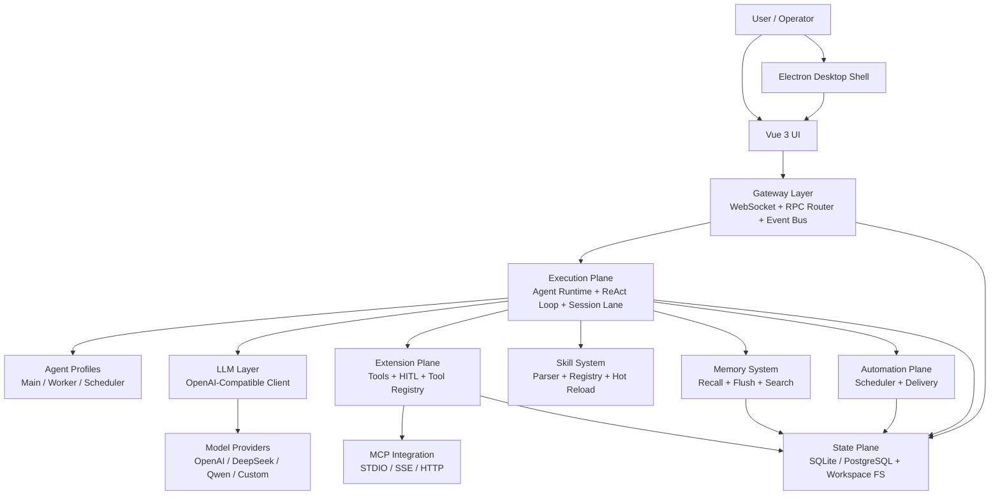
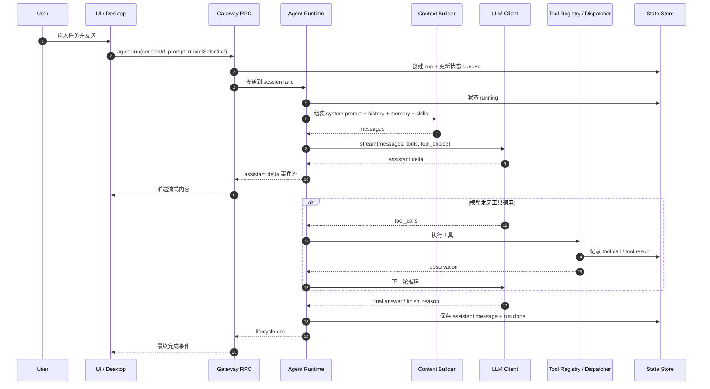
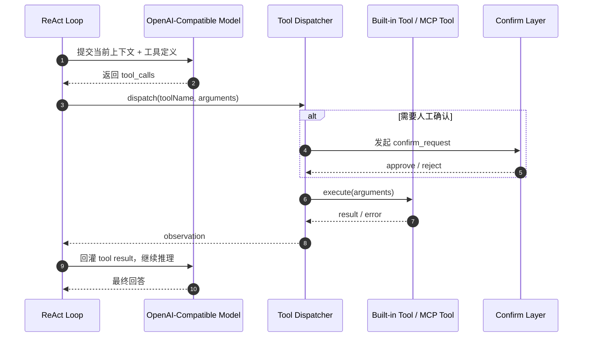
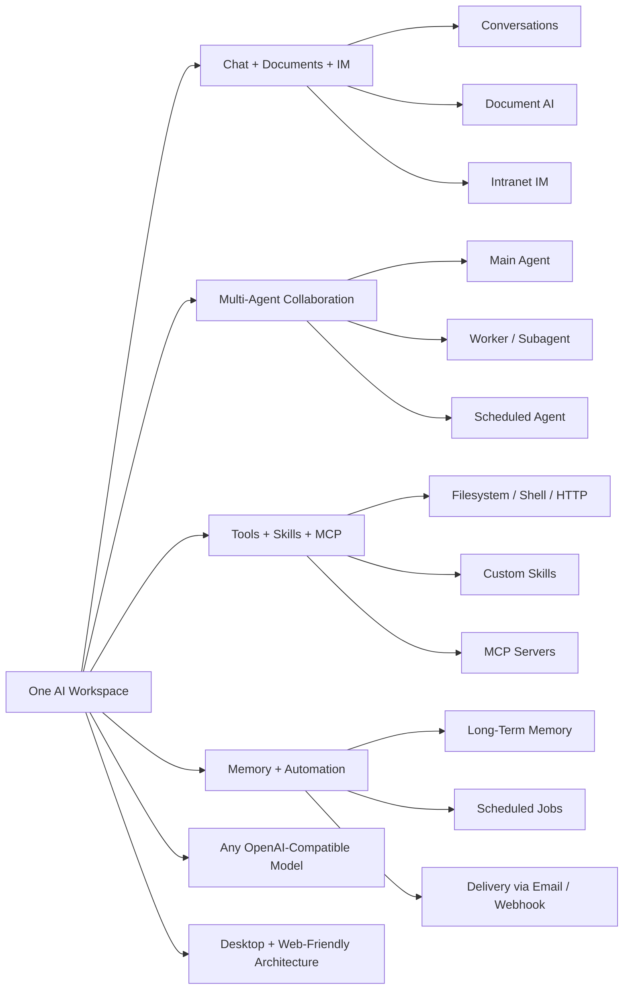
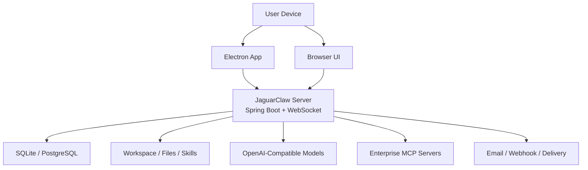

# JaguarClaw Mermaid 架构图集

这份文档整理了适合内部沟通、技术评审和对外展示的 Mermaid 图。

建议使用支持 Mermaid 的 Markdown 渲染器查看。

## 1. 总体架构图

这张图偏内部技术视角，贴近当前代码结构和运行时分层。

## 2. `agent.run` 主链路时序图

这张图适合解释一次正常会话是怎样从前端一路流转到模型和工具执行的。

## 3. 工具调用闭环时序图

这张图更适合讲 JaguarClaw 的 agentic 核心，不强调 UI，而强调 ReAct + Tool Use。

## 4. 对外展示版产品图

这张图偏产品表达，适合放官网、PPT 或外部介绍材料。

## 5. 部署与集成拓扑图

这张图适合对外解释“如何落地到客户环境”。

## 6. 对外讲解建议

- 面向研发团队：优先用“总体架构图 + `agent.run` 主链路时序图”
- 面向客户或投资人：优先用“对外展示版产品图 + 部署与集成拓扑图”
- 面向实施或售前：补充“工具调用闭环时序图”，强调可控、可扩展、可接企业系统
