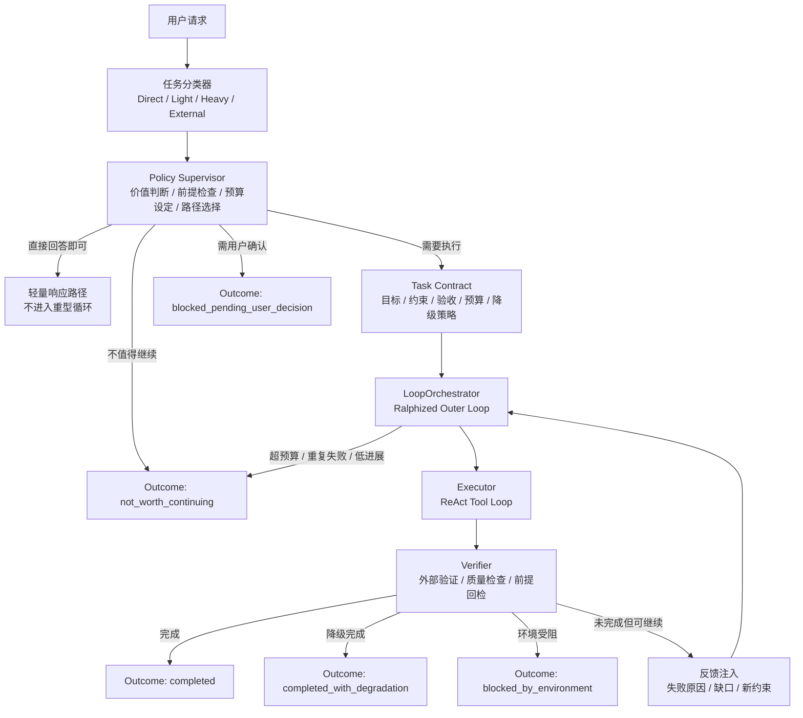
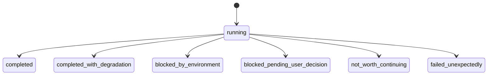
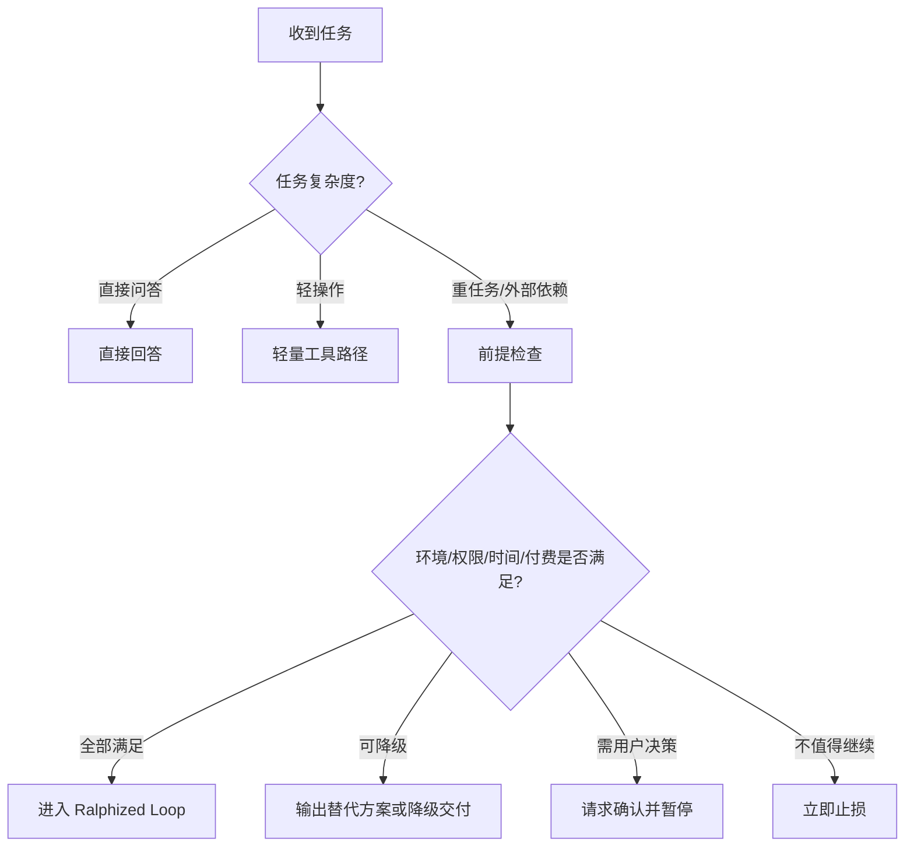
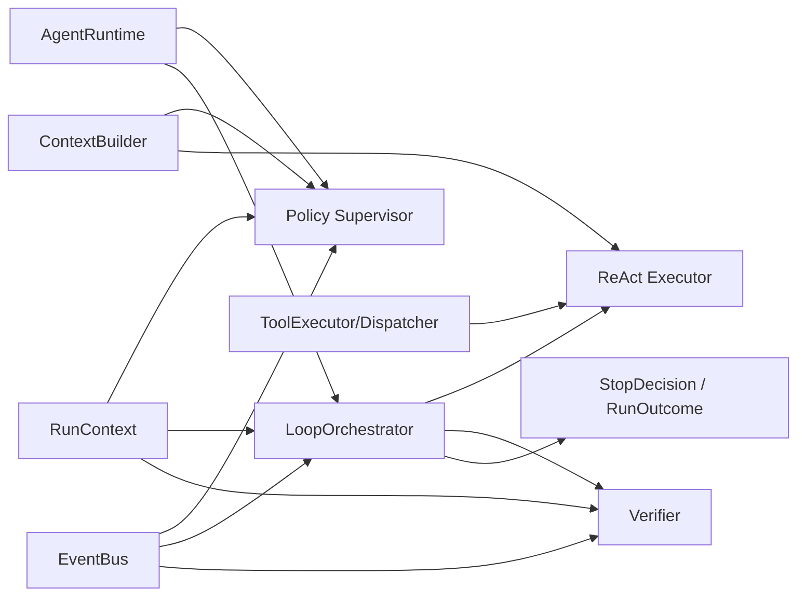

# Agent 智能止损、Ralph Loop 与策略层重构设计

## 1. 背景

当前系统的多轮交互主要由 ReAct 驱动：模型基于当前上下文决定是否继续思考、调用工具、读取结果并进入下一轮。这种模式在“环境完备、任务边界清晰、工具链稳定”的情况下可以顺畅完成复杂任务，但在真实用户场景中暴露出两个体验层面的核心问题：

1. **默认过度执行**：即使是“今天几号”“有多少内存”这类轻问题，也会被拉入一套昂贵的系统提示、工具索引和多轮执行框架。
2. **遇阻不止损**：当任务遭遇前置条件缺失、工具不可用、第三方服务付费、时间窗口错误、结果质量异常等问题时，系统倾向于“继续尝试解决阻碍本身”，而不是重新评估任务是否仍值得推进。

这会导致一个典型的用户感知：

- Agent 很努力；
- Agent 也未必完全不聪明；
- 但 Agent **不懂成本，不会止损，也不会在合适的时候变通**。

真正损害体验的，不是 Agent 中途停下来，而是 Agent 在不值得继续时仍然继续，并持续消耗：

- token 成本；
- 用户等待时间；
- 系统稳定性；
- 结果可信度；
- 用户对整个系统的信任。

因此，本轮设计讨论不把问题定义为“如何让 Agent 更能坚持”，而是定义为：

> **如何让 Agent 以合理成本解决真实用户目标，而不是以完成步骤为唯一目标。**

---

## 2. 当前痛点复盘

结合现有体验问题，可将痛点归纳为四类。

### 2.1 输入成本与任务复杂度不匹配

新会话第一轮通常注入大段 system prompt、工具定义、skill 索引与运行约束。对复杂任务来说这可能合理，但对简单问答则明显过重，导致：

- 首轮 token 成本高；
- 轻任务响应链路被重任务机制绑架；
- 模型被暗示“应该复杂地完成一件事”。

### 2.2 运行目标被错误地定义为“完成步骤”

在现有 ReAct 模式下，系统隐含的默认价值观更接近：

- 任务一旦进入执行态，就应尽量完成；
- 遇到障碍，应先解决障碍；
- 不到明确失败，不应停止；
- 只有交付“最终成品”才算成功。

这种价值观适合 benchmark，不适合真实产品。

### 2.3 缺少“继续是否划算”的外部判断

当前循环控制通常聚焦在：

- 最大步数；
- 超时；
- 用户取消。

但这三者都属于**技术性保护**，不是**业务性判断**。它们能防止无限循环，却不能回答：

- 这件事还值得继续吗？
- 当前路径是否已经劣于替代方案？
- 当前阻碍是“暂时故障”，还是“前提不成立”？

### 2.4 缺少“中止也是成功”的结果模型

如果系统内部只有 `success/failure` 二元状态，那么 Agent 会天然排斥停止，因为停止意味着失败。这会直接诱发无意义尝试。

但在用户视角里，以下情况都可能是高质量结果：

- 明确指出环境依赖缺失，并给出替代交付格式；
- 告知任务可行，但需要付费服务或额外授权；
- 提前识别时间范围错误，阻止无效执行；
- 说明继续尝试的边际收益过低，建议人工决策。

这些都不应被视为失败，而应被视为**合理止损后的有效完成**。

---

## 3. 根因：当前 Agent 的优化目标错位

从系统设计角度看，当前通用 Agent 的核心问题不是“推理能力不够”，而是**优化目标错位**。

### 3.1 当前隐含目标函数

大多数 ReAct Agent 实际在优化：

1. 尽量执行更多步骤；
2. 尽量克服局部错误；
3. 尽量输出一个“看起来完成了”的结果；
4. 在外部强制限制前不要停止。

### 3.2 用户真实目标函数

用户真正希望系统优化的是：

1. 先判断值不值得做；
2. 先选择最便宜的可行路径；
3. 一旦遇阻，快速判断是重试、改道、降级还是停止；
4. 必要时请求确认，而不是代替用户持续烧成本；
5. 对最终“投入 / 产出比”负责，而不是对步骤数量负责。

因此，本质上不是“让 ReAct 更强”，而是要把架构从：

- **ReAct 作为全局控制器**

转向：

- **策略层决定是否执行与何时停止；ReAct 只负责局部探索与执行。**

---

## 4. Ralph Loop 的价值与边界

在调研中，`ralph-loop-agent` 提供了非常重要的启发。其核心思想不是让 Agent 一直循环，而是：

- 在普通工具循环之外再包一层**外部验证循环**；
- 由外部 `RuntimeDecisionStage` / `VerificationResult` 判断任务是否真正完成；
- 使用迭代次数、token、成本等预算控制外层循环；
- 当验证失败时，将失败原因反馈给下一轮，而不是盲重试。

这一思想的价值在于：

1. **把“是否完成”从 LLM 自我宣告，变成外部验证。**
2. **把“是否继续”从模型偏好，变成系统预算和规则。**
3. **把“重试”从重复执行，变成带反馈的迭代修正。**

### 4.1 Ralph 对当前系统的直接启发

它非常适合解决以下问题：

- 遇到依赖缺失、结果未达标、目标文件未生成时，不能只听模型说“已经完成”；
- 需要引入 `maxTokens`、`maxCostUsd`、`maxRepeatedFailures` 之类的预算，而不只是 `maxSteps`；
- 需要在长任务中对历史上下文进行压缩与重建，而不是简单累加。

### 4.2 Ralph 不能单独解决的问题

Ralph 并不天然解决：

- 当前任务是否值得进入重型循环；
- 是否存在更便宜的替代路径；
- 何时应转为“待用户决策”；
- 何时应因商业约束、权限约束、时间约束而停止。

换句话说：

- **Ralph 解决的是“如何更有纪律地循环”。**
- **它不直接解决“该不该循环、循环哪条路最划算”。**

因此，Ralph 对本项目的最佳定位不是终局方案，而是：

> **从“LLM 主导的 ReAct 循环”过渡到“系统可控的执行循环”的关键中间层。**

---

## 5. 设计原则

基于上面的分析，未来 Agent 架构应遵循以下原则。

### 5.1 结果优先，而非步骤优先

Agent 的目标不是“把计划走完”，而是“在合理成本内推动用户目标达成”。

### 5.2 默认保守，而不是默认激进

对高成本、长链路、外部依赖强的任务，系统应该默认：

- 先确认前提；
- 先判断收益；
- 再进入深执行。

### 5.3 中止不是失败，无谓尝试才是失败

系统必须合法化以下行为：

- 因环境缺失而停止；
- 因成本不合理而停止；
- 因存在更优替代而改道；
- 因需要授权/付费/人工选择而暂停。

### 5.4 验证必须外部化

不能仅靠模型自述“我已经完成了”。必须存在明确的、可解释的外部验证与完成标准。

### 5.5 预算必须多维化

预算不应只有步数，还应至少包括：

- token 预算；
- 成本预算；
- 时间预算；
- 重复失败预算；
- 低进展轮次预算。

### 5.6 上下文要服务决策，而不是堆叠历史

不是所有历史都值得保留。系统应该保留：

- 当前目标；
- 当前约束；
- 已验证事实；
- 已失败路径；
- 下一步真正需要的信息。

---

## 6. 目标架构：Policy + Ralphized Loop + Outcome Model

未来建议采用三层式架构：

1. **Policy / Supervisor 层**：决定是否值得执行、选择哪条路径、何时止损。
2. **Ralphized Loop 层**：负责受预算约束的多轮执行与外部验证。
3. **Outcome 层**：把运行结果表达成结构化结果，而不是简单成败。

### 6.1 总体架构图

### 6.2 关键变化

这个架构与传统 ReAct 的差别不是“加了更多模块”，而是把权力重新分配：

- **ReAct 不再决定全局是否继续**；
- **Verifier 不再只是日志，而是决定任务是否已达成**；
- **Policy 不再是 prompt 文案，而是可执行的控制逻辑**；
- **Outcome 不再是 success/failure，而是多态完成语义**。

---

## 7. Outcome Model：先解决“停下来算不算成功”

这是最关键的一层。如果内部状态仍然只有 `success/failure`，再好的策略层也会被强行拉回“继续做”。

建议引入以下结果模型：

### 7.1 各结果含义

- `completed`
  - 用户目标已按理想路径完成。

- `completed_with_degradation`
  - 核心目标达成，但交付形式降级。
  - 例：无法导出 PDF，但成功生成 HTML/Markdown。

- `blocked_by_environment`
  - 前置条件缺失，系统已明确说明阻碍与可恢复条件。
  - 例：缺字体、缺二进制依赖、缺登录态、缺权限。

- `blocked_pending_user_decision`
  - 存在多条合理路径，但需要用户在成本、权限、付费等方面做决定。
  - 例：RSS.app 需要付费，是否继续购买。

- `not_worth_continuing`
  - 继续尝试的边际收益过低，系统主动止损。
  - 例：同一类依赖安装失败多次，且无新信息输入。

- `failed_unexpectedly`
  - 真实异常，超出预设恢复策略。

### 7.2 为什么这一层优先级最高

因为只有当“停止”被合法化，后续的：

- 止损策略；
- 替代方案；
- 待确认分支；
- 降级交付；

才有可靠落点。

---

## 8. Policy / Supervisor：真正决定“值不值得继续”

Ralph 的价值在于“循环受控”，但用户体验的上限取决于 Policy 层。

### 8.1 Policy 的职责

Policy 层应该在进入深执行前，回答以下问题：

1. 这是直接回答、轻操作还是重任务？
2. 当前任务是否需要真正进入多轮执行？
3. 是否存在明显更便宜的路径？
4. 是否存在前置条件缺失？
5. 是否触及付费、授权、登录、时效等需要用户决策的边界？
6. 一旦遇阻，优先策略是重试、改道、降级还是停止？

### 8.2 Policy 决策图

### 8.3 典型策略规则

建议最先落地的不是复杂策略模型，而是显式规则：

- **简单问题禁止进入重型 loop**
  - 如日期、系统信息、简短解释。

- **前提缺失优先报告，不优先修复**
  - 尤其是安装依赖、外部服务授权、账号登录、付费能力。

- **同类失败重复超过阈值后，不再默认重试**
  - 除非新的输入或环境变化出现。

- **当存在明显更便宜路径时，优先切换**
  - PDF → HTML/Markdown；网页抓取 → RSS/API；长流程 → 先交中间结果。

- **涉及货币成本或隐私风险时，必须转用户确认**

### 8.4 这层为什么不能只靠 prompt 解决

因为 prompt 只能影响模型倾向，不能提供稳定的、可观测的、可回放的系统决策。真正影响体验的策略必须是运行时显式逻辑。

---

## 9. Ralphized Loop：从“执着执行”到“受控循环”

在进入执行态后，建议保留 ReAct 作为局部执行器，但由更强的外层循环约束。

### 9.1 外层循环职责

外层循环负责：

- 初始化任务 contract；
- 控制总预算；
- 调用执行器；
- 调用 verifier；
- 根据验证结果与预算状态决定继续、降级、停止或待确认。

### 9.2 内层执行器职责

内层仍可保持类似现有 ReAct 的能力：

- 选择工具；
- 调用工具；
- 读写文件；
- 处理观察；
- 输出下一步或中间结果。

区别在于：

- 内层执行器不再拥有“我已经完成”的最终解释权；
- 内层执行器也不应无限放大局部问题的重要性。

### 9.3 建议引入的停止条件

除现有 `maxSteps` 之外，至少再增加：

- `maxTokens`
- `maxCostUsd`
- `maxRepeatedFailures`
- `maxLowProgressRounds`
- `maxEnvironmentRepairAttempts`

其中最有产品价值的往往不是 `maxSteps`，而是：

- **重复失败**：同类失败反复出现；
- **低进展轮次**：执行很多轮，但任务状态没有本质推进；
- **环境修复预算**：不要为了一个外围问题无限折腾。

### 9.4 反馈注入的正确方式

下一轮不应注入“请继续完成任务”这种模糊反馈，而应注入结构化反馈，例如：

- 当前未完成原因；
- 已验证失败的路径；
- 当前剩余预算；
- 被禁止重复尝试的动作；
- 可接受的降级目标。

这会把循环从“反复试错”转成“有记忆的收敛”。

---

## 10. Verifier：完成判断必须从“存在性检查”升级为“目标检查”

这是 Ralph 最容易被误用的地方。

如果 verifier 只检查：

- 文件是否存在；
- 命令是否退出 0；
- 某个输出是否被生成；

那么系统仍可能“有纪律地做错事”。

### 10.1 正确的 verifier 组成

一个好的 verifier 至少要验证：

1. **目标是否满足**
   - 用户要的是“新闻整理结果”，还是“必须 PDF”？

2. **质量是否达标**
   - 例：PDF 虽生成，但乱码严重，则不能算完成。

3. **约束是否被尊重**
   - 时间范围、权限边界、预算边界是否被破坏。

4. **是否存在更合理结论**
   - 当前更应输出 `blocked`、`degraded`，还是继续执行。

### 10.2 验证不是单一函数，而是一套判定规则

建议把 verifier 理解为一组组合式检查：

- 结构检查；
- 业务检查；
- 质量检查；
- 风险检查；
- 成本检查。

只有这样，系统才不会被错误的单点验收标准驱动到错误方向。

---

## 11. Context 策略：减少“上下文膨胀”对行为的误导

虽然本轮优先级聚焦“智能止损”，但上下文策略与之强相关。

因为一个被重型 prompt 包裹的 Agent，会更倾向于把所有问题都视为“需要复杂执行的任务”。

### 11.1 需要改变的不是单纯压缩，而是装配策略

建议把上下文装配分层：

- **L0：最小身份层**
  - 简短角色、核心安全边界、当前会话元信息。

- **L1：任务 contract 层**
  - 目标、约束、预算、可接受降级、禁用路径。

- **L2：必要历史层**
  - 只保留与当前判断有关的事实与失败路径。

- **L3：工具/skill 扩展层**
  - 仅在确认需要时再按需注入。

### 11.2 简单问题不应进入完整技能态

例如：

- “今天几号”
- “有多少内存”
- “帮我解释这个报错是什么意思”

这些请求不应该默认注入完整 skill index、全量工具描述、复杂执行规则。否则系统会过度进入“我是一个应该行动的 Agent”状态。

### 11.3 上下文的目标是帮助决策，而不是保证完整性

过多上下文并不一定提升完成率，反而会提升：

- 行动冲动；
- 自我合理化；
- 对局部错误的执着修复；
- token 消耗。

---

## 12. 与现有 JaguarClaw 架构的对应关系

从当前代码结构看，这次改造不需要推翻已有系统，而是重分职责。

### 12.1 当前已有基础

已有的这些能力都可以继续复用：

- `AgentRuntime`：现有循环主入口
- `LoopOrchestrator`：已有循环控制雏形
- `RunContext`：运行态信息容器
- `ContextBuilder`：上下文装配
- `ToolExecutor` / `ToolDispatcher`：工具执行
- `CancellationManager`：取消管理
- `EventBus`：过程事件与观测

### 12.2 建议的演进映射

### 12.3 关键职责调整

> 结合当前实现，`RunOutcome`、`PolicySupervisor`、`RuntimeDecisionStage`、`StopDecision` 与 `run.outcome` 事件已具备落地点；`LoopState` 仍作为兼容层保留。

- `AgentRuntime`
  - 从“直接驱动 ReAct 全循环”变成总编排入口。

- `LoopOrchestrator`
  - 从“步数/超时检查器”升级为真正的外层循环控制器。

- `RunContext`
  - 增加预算、失败分类、进展评估、任务 contract、outcome。

- `ContextBuilder`
  - 从“默认重上下文装配器”升级为按任务层级装配上下文。

- 新增 `PolicySupervisor`
  - 决定是否进入深执行、是否应改道、是否需用户确认。

- 新增 `RuntimeDecisionStage`
  - 负责结构化完成判断。

- 新增 `StopDecision` 与 `RUN_OUTCOME` 事件
  - 前者负责把预算与止损条件变成结构化停止判断，后者负责把最终结果发布给 UI 与自动化链路。

---

## 13. 典型场景推演

### 13.1 场景一：简单事实问答

用户：今天几号？

理想路径：

1. 任务分类器识别为直接问答；
2. 不进入重型 loop；
3. 使用轻量上下文直接回答；
4. 返回 `completed`。

### 13.2 场景二：整理今日 AI 新闻并导出 PDF

理想路径：

1. 分类为“重任务 + 外部依赖型”；
2. Policy 先检查是否具备 PDF 导出前提；
3. 若缺依赖：
   - 判断是否可降级为 HTML/Markdown；
   - 若可，直接走降级路径，返回 `completed_with_degradation`；
   - 若用户明确必须 PDF，则返回 `blocked_by_environment`。
4. 若进入执行态后发现乱码严重，Verifier 不能判定为 `completed`。

### 13.3 场景三：监控推特账号

理想路径：

1. 分类为“长期监控 + 外部平台约束”；
2. Policy 检查：
   - RSS.app 是否需要付费；
   - 是否有更低成本替代；
   - 时间范围判断是否准确；
3. 若存在成本或订阅选择，转 `blocked_pending_user_decision`；
4. 避免在未确认商业成本的情况下自动推进。

---

## 14. 推荐落地顺序

本设计不建议一次性“大重构”，而建议分阶段落地。

### Phase 1：先合法化“合理停止”

目标：从结果语义上让系统敢于停止。

- 引入 Outcome Model
- 把 `success/failure` 改成多态结果
- 在用户面向输出中体现“阻塞 / 降级 / 待确认 / 不值得继续”

### Phase 2：引入 Ralph 核心能力

目标：把停止从“靠感觉”变成“靠外部验证与预算”。

- 引入 `RuntimeDecisionStage` / `VerificationResult`
- 增加 `maxTokens` / `maxCostUsd` / `maxRepeatedFailures` / `maxLowProgressRounds`
- 通过 `StopDecision` 与失败分类反馈注入约束下一轮

### Phase 3：引入 Policy / Supervisor

目标：在进入深执行前做更理性的前置判断。

- 任务分类
- 前提检查
- 替代路径选择
- 用户确认门控

### Phase 4：重构 Context 策略

目标：避免重型上下文默认污染轻任务与前期判断。

- 任务分层上下文装配
- 工具与 skill 延迟注入
- 历史精简与失败路径摘要

---

## 15. 最终判断

这次讨论最重要的共识有三个：

1. **中断并不意味着 AI 不智能。**
   - 相反，在高成本、低收益、前提不成立时及时中止，本身就是更高层次的智能。

2. **真正的问题不是 Agent 不会做事，而是 Agent 不会判断“是否还值得做”。**
   - 这不是单靠 prompt 能解决的，需要架构级的控制逻辑。

3. **Ralph Loop 对本项目非常有价值，但它是桥梁，不是终局。**
   - 它帮助我们把“完成判断”和“继续条件”从 LLM 手里拿回来；
   - 但真正决定用户体验上限的，是 Ralph 之上的 Policy / Supervisor 层。

因此，本项目接下来的正确方向不是：

- 单纯把 ReAct 做得更强；
- 或单纯把上下文压得更短；

而是：

> **把 Agent 从“默认持续执行的流程机”，升级成“对任务收益、成本、阻塞和替代方案有判断力的执行系统”。**

一句话总结：

> **用 Policy 决定是否进入循环；用 Ralph Loop 约束执行；用 Verifier 判断是否完成或止损；用 Outcome Model 合法化合理停止。**

---

## 16. 参考

- Ralph Loop Agent（Vercel Labs）
  - https://github.com/vercel-labs/ralph-loop-agent
- Wiggum CLI 对 Ralph Loop 的工程化表达
  - https://wiggum.app/
- Inference-Time Scaling of Verification（验证驱动的推理时扩展）
  - https://arxiv.org/abs/2601.15808
- 本仓库内部分析
  - `docs/ralph-loop-analysis.md`
  - `docs/context-management-optimization.md`

