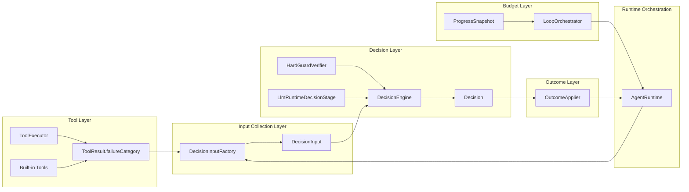

# Ralph Agent Core Architecture

**Status:** Current as of 2026-03-09 after the main-flow refactor batches were completed.

**Goal:** Document the current Ralph agent core execution path, decision boundaries, responsibilities, and health status so future work continues from the refactored architecture instead of the older mixed runtime flow.

**Scope:** This document focuses on the heavy-loop / ReAct runtime path and the components that decide whether the agent continues, stops, asks the user, or terminates with an outcome.

---

## 1. Executive Summary

当前这条 agent 主路径**整体是 ok 的**，而且已经明显比重构前更清晰：

- 运行时输入已经统一收口到 `DecisionInput`
- 语义决策已经统一收口到 `DecisionEngine`
- 决策副作用已经统一收口到 `OutcomeApplier`
- 循环预算控制已经基本收口到 `ProgressSnapshot` + `LoopOrchestrator`
- 工具失败语义已经优先走结构化 `failureCategory`，不再靠文本猜

换句话说，主路径已经从“多处边判断边副作用”的模式，变成了：

**收集输入 → 统一决策 → 统一落地 → 循环推进**

这正是当前最重要的架构收益。

---

## 2. Current Health Assessment

### 2.1 Overall Judgment

**结论：当前 agent 主路径可以认为是健康的，可以继续作为后续工作的基础。**

理由：

- 关键职责边界已经建立，不再严重耦合
- 关键 stop / continue 逻辑已经从文本判断迁出
- 关键 outcome / progress side effects 已有单一出口
- 关键回归测试已经覆盖 runtime / verifier / handler / tool executor 相关主链路

### 2.2 What Is Good Now

- `AgentRuntime` 主要负责循环编排，而不是直接做语义判断
- `DecisionEngine` 成为唯一语义决策入口
- `HardGuardVerifier` 与 `LlmRuntimeDecisionStage` 的职责已经分层
- `OutcomeApplier` 成为 outcome 与 progress accounting 的统一落点
- `LoopOrchestrator` 不再直接承担大部分运行时语义判断
- HITL 拒绝已经不再依赖 marker 文本判断主路径语义，而是依赖结构化 `failureCategory`

### 2.3 Remaining Non-Blocking Debt

下面这些问题仍然存在，但它们**不构成当前主路径不可用**：

1. **接口命名仍带历史语义**
   - `RuntimeDecisionStage` 现在已经直接返回 `Decision`
   - 但名字仍保留 stage / verifier 过渡语义
   - 这是命名层面的余留，不影响主路径正确性

2. **`AgentRuntime` 里仍有少量历史命名**
   - 例如 `applyDecision(...)` 这类方法名仍偏“兼容迁移期”
   - 语义已经正确，但可以继续收口命名

3. **README 级说明还没补齐**
   - 当前架构文档已经补充
   - 但仓库顶层说明还没有同步这套运行时职责划分

### 2.4 Bottom Line

如果问题是：

> “目前的 agent 路径是不是 ok？”

我的判断是：

**是，ok。**

更准确地说：

**主路径已经达到“结构清晰、责任分层、可继续演进”的状态；剩下的是收尾型优化，不是架构性阻塞。**

---

## 3. End-to-End Main Flow

下面是当前主路径的 Mermaid 流程图。

```mermaid
flowchart TD
    A[用户输入 / agent.run] --> B[AgentRunHandler / 路由层]
    B --> C[AgentRuntime.executeLoopWithContext]

    C --> D[PolicySupervisor.evaluate]
    D -->|直接阻断 / 不进 heavy loop| E[OutcomeApplier.apply]
    E --> Z[返回最终结果]

    D -->|进入主循环| F[LoopOrchestrator.checkStopDecision]

    F -->|cancel / timeout| Z
    F -->|maxSteps / budget stop with outcome| H[OutcomeApplier.apply]
    H --> Z
    F -->|continue| I[AgentRuntime.executeSingleStep]

    I --> J[LLM 返回 StepResult]

    J -->|无 tool calls| K[DecisionInputFactory.fromAssistantStep]
    K --> L[resolveDecisionStage(context).verify]
    L --> L1[DecisionEngine]
    L1 --> M[DecisionEngine.decide]
    M --> M1[HardGuardVerifier.verify]
    M --> M2[LlmRuntimeDecisionStage.verify]
    M1 --> N[Decision]
    M2 --> N
    N --> O[OutcomeApplier.apply]
    O -->|terminal| Z
    O -->|continue| F

    J -->|有 tool calls| P[ToolExecutor.executeToolCalls]
    P --> P1[HITL / dispatch / tool.result]
    P1 --> P2[ToolExecutionResult + failureCategory]

    P2 --> Q[AgentRuntime 追加 tool 消息]
    Q --> R{HITL_REJECTED?}
    R -->|是| S[停止自动重试并提示用户]
    S --> Z
    R -->|否| T[recordToolRoundProgress]

    T --> U[DecisionInputFactory.fromToolRound]
    U --> V[resolveDecisionStage(context).verify]
    V --> V1[DecisionEngine]
    V1 --> W[DecisionEngine.decide]
    W --> W1[HardGuardVerifier.verify]
    W --> W2[LlmRuntimeDecisionStage.verify]
    W1 --> X[Decision]
    W2 --> X

    X --> Y[OutcomeApplier.apply]
    Y -->|terminal| Z
    Y -->|continue + feedback| F
```

---

## 4. Responsibility-Oriented Architecture

下面这张图按职责分层，而不是按调用顺序分层。



---

## 5. Component-by-Component Responsibilities

### 5.1 `AgentRuntime`

职责：
- 负责主循环编排
- 负责触发单步 LLM 调用
- 负责触发工具执行
- 负责串联 `DecisionInputFactory`、`DecisionEngine`、`OutcomeApplier`
- 负责维护 loop 内消息推进和 subagent barrier 等流程控制

不应该承担的职责：
- 不应该自己决定 repairable failure 是继续还是终止
- 不应该自己拼复杂语义决策
- 不应该分散落地 outcome side effects

当前结论：
- 这部分已经大体合格

关键代码：
- `src/main/java/com/jaguarliu/ai/runtime/AgentRuntime.java:123`

### 5.2 `DecisionInputFactory`

职责：
- 从 assistant-only round 构造 `DecisionInput`
- 从 tool round 构造 `DecisionInput`
- 从 verifier 兼容入口构造 `DecisionInput`
- 保证决策层消费的是快照，而不是散乱现场状态

当前结论：
- 这部分已经清晰，是当前架构的关键收口点之一

关键代码：
- `src/main/java/com/jaguarliu/ai/runtime/DecisionInputFactory.java:13`

### 5.3 `DecisionEngine`

职责：
- 作为统一语义决策入口
- 先运行 `HardGuardVerifier`
- 再运行 `LlmRuntimeDecisionStage`
- 返回统一 `Decision`

当前结论：
- 这是当前最重要的架构中枢，方向正确

关键代码：
- `src/main/java/com/jaguarliu/ai/runtime/DecisionEngine.java:11`

### 5.4 `HardGuardVerifier`

职责：
- 只处理真正的硬阻断
- 目前主要是：
  - `hard_environment_block`
  - `user_decision_required`

明确不做：
- 不负责 repair strategy
- 不负责“是否值得继续尝试修复”

当前结论：
- 命名和职责已经基本一致

关键代码：
- `src/main/java/com/jaguarliu/ai/runtime/HardGuardVerifier.java:12`

### 5.5 `LlmRuntimeDecisionStage`

职责：
- 处理语义层判断
- 综合 assistant reply、tool observations、runtime failure categories、progress snapshot
- 决定：
  - completed
  - blocked by environment
  - blocked pending user decision
  - continue with feedback
  - not worth continuing

当前结论：
- 这是“LLM-led runtime decision”的核心执行器
- 目前设计目标已经落地

关键代码：
- `src/main/java/com/jaguarliu/ai/runtime/LlmRuntimeDecisionStage.java:21`

### 5.6 `OutcomeApplier`

职责：
- 应用 `Decision` 的副作用
- 更新 `RunContext`
- 记录 failure / repair attempt / meaningful progress
- 处理 terminal outcome state
- 发布 runtime outcome event
- 选择最终可见消息

当前结论：
- 这部分已经是明确的单一出口，收益非常大

关键代码：
- `src/main/java/com/jaguarliu/ai/runtime/OutcomeApplier.java:13`

### 5.7 `ProgressSnapshot`

职责：
- 封装 repeated-failure / repair-budget / low-progress 的聚合判断素材
- 让预算判断不再散落在 orchestrator 或 runtime 中

当前结论：
- 这是把“值班判断”从循环控制器里拆出去的关键一步

关键代码：
- `src/main/java/com/jaguarliu/ai/runtime/ProgressSnapshot.java:6`

### 5.8 `LoopOrchestrator`

职责：
- 只处理预算类停止条件：
  - cancelled
  - timed out
  - max steps
  - repeated failures
  - low progress
  - token budget

当前结论：
- 已比重构前干净很多
- 仍保留 stop decision event 发布职责，但已不再主导复杂语义决策

关键代码：
- `src/main/java/com/jaguarliu/ai/runtime/LoopOrchestrator.java:24`

### 5.9 `ToolExecutor`

职责：
- 执行工具调用
- 执行 HITL 流程
- 构造 `ToolExecutionResult`
- 优先从 `ToolResult.failureCategory` 推导失败语义

当前结论：
- 主路径已经摆脱了基于文本 marker 的 failure 归类依赖
- 这是当前“别再靠字符串猜”的关键防线之一

关键代码：
- `src/main/java/com/jaguarliu/ai/runtime/ToolExecutor.java:279`

---

## 6. Core Data Objects

### 6.1 `DecisionInput`

作用：
- 表达一轮决策时可见的统一输入

主要内容：
- `assistantReply`
- `observations`
- `runtimeFailureCategories`
- `progressSnapshot`
- `currentStep`
- `environmentRepairAttempts`
- `hasToolCalls`
- `hasPendingSubagents`

关键代码：
- `src/main/java/com/jaguarliu/ai/runtime/DecisionInput.java:9`

### 6.2 `Decision`

作用：
- 表达统一决策结果

主要内容：
- `terminal`
- `continueLoop`
- `outcome`
- `failureCategory`
- `feedback`
- `reason`

关键代码：
- `src/main/java/com/jaguarliu/ai/runtime/Decision.java:6`

### 6.3 `ToolResult.failureCategory`

作用：
- 表达工具层能稳定知道的结构化失败语义

关键代码：
- `src/main/java/com/jaguarliu/ai/tools/ToolResult.java:15`

---

## 7. Decision Boundaries

### 7.1 Tool Layer Boundary

原则：
- 工具层负责说清楚“发生了什么”
- 例如：命令不存在、权限阻断、需要用户决策、策略拒绝、工具内部错误
- 工具层不负责说“循环该不该继续”

### 7.2 Decision Layer Boundary

原则：
- `DecisionEngine` 负责说“接下来怎么办”
- `HardGuardVerifier` 负责硬守卫
- `LlmRuntimeDecisionStage` 负责语义判断

### 7.3 Outcome Layer Boundary

原则：
- 只要涉及 outcome state、progress accounting、final visible message，就应该通过 `OutcomeApplier`

### 7.4 Budget Layer Boundary

原则：
- 只要是“剩余预算是否允许继续”的问题，就应该落在 `ProgressSnapshot` / `LoopOrchestrator`
- 预算层不应该靠文本理解工具报错内容

---

## 8. What Was Explicitly Removed

本次重构最重要的，不只是“加了什么”，还有“明确去掉了什么”：

- 去掉了 runtime 主路径对文本型 failure classifier 的依赖
- 去掉了通过 marker 文本判断 HITL 主路径语义的做法
- 去掉了把 repair strategy 放在默认 verifier 里的做法
- 去掉了 `VerificationResult` 在主链路中的存在

这几点共同保证：

**不要再把 stop/continue 的决定建立在字符串解析之上。**

---

## 9. Current Path Validation Evidence

本次文档编写前，再次做了相关回归验证。

已通过测试：

```bash
mvn -q -Dtest='DecisionTest,DecisionEngineTest,HardGuardVerifierTest,DecisionEngineTest,LlmRuntimeDecisionStageTest,DecisionInputFactoryTest,OutcomeApplierTest,ProgressSnapshotTest,LoopOrchestratorTest,RunContextTest,ToolExecutorTest,AgentRuntimeTest,AgentRunWithAgentIdTest' test
```

覆盖面包括：
- runtime 主循环
- verifier / decision 路径
- outcome 应用
- loop budget
- tool executor
- handler 前端可见性路径

因此，关于：

> 目前的 agent 路径是不是 ok？

当前证据支持的结论是：

**是，ok。**

而且不是“勉强能跑”的 ok，而是：

**主路径已经具备比较明确的职责边界，可以继续在这个基础上安全演进。**

---

## 10. Recommended Next Steps

如果还要继续收尾，我建议优先级如下：

1. **统一命名语义**
   - 评估是否将 `RuntimeDecisionStage` / `applyDecision(...)` 等历史命名进一步收口
   - 目标是让“decision”语义在接口与调用点上一致

2. **统一 stop path 的 outcome event 语义**
   - 当前 stop decision path 与普通 terminal path 的 event 发布来源仍是两段式
   - 这不是 bug，但可以继续统一

3. **补 README 级说明**
   - 在 `README.md` / `README.zh-CN.md` 里补充这套运行时架构原则

4. **继续保持 guardrails**
   - 不要引入新的 regex runtime stop logic
   - 不要引入新的 command-name special case
   - 不要让 `RuntimeFailureClassifier` 回流到主路径

---

## 11. One-Sentence Summary

当前 Ralph agent 的核心架构，已经稳定收口为：

**`AgentRuntime` 编排、`DecisionInputFactory` 收集输入、`DecisionEngine` 决策、`OutcomeApplier` 落地、`LoopOrchestrator` 控预算。**
