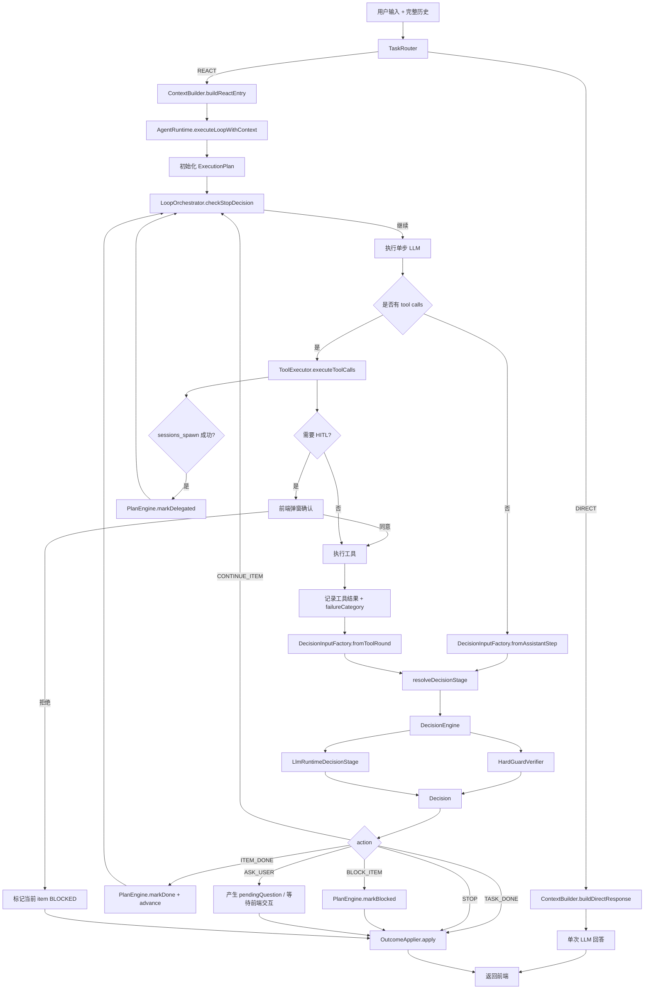

# Ralph Agent Core Architecture

**Status:** implemented state on 2026-03-09  
**Scope:** current top-level routing, ReAct runtime, verifier chain, HITL position, and in-memory long-task plan kernel

---

## 1. 设计目标

当前版本的核心目标已经收敛成 4 条：

1. **顶层只做一次简单分流：`DIRECT` / `REACT`**
2. **凡是“需要执行”的任务，一律进入 `REACT`**
3. **HITL 是前端确认机制，不是聊天问答机制**
4. **长任务在 `REACT` 内部靠内存态 plan 按 item 推进，而不是频繁提前停机**

这意味着现在的系统不再试图在路由层做过多能力裁剪，也不再依赖命令名、正则或关键词做主流程判断。

---

## 2. 当前主架构

### 2.1 顶层分流

顶层分流现在只有两种：

- `DIRECT`
  - 仅回答问题
  - 不进入执行循环
  - 使用更轻的上下文构造
- `REACT`
  - 只要任务带有执行性质，就进入运行时循环
  - 保留工具调用能力
  - 保留 HITL、subagent、verifier、plan kernel 能力

这层的职责很小：**只决定“纯回答”还是“进入执行态”**。

### 2.2 ReAct 运行时

`REACT` 是系统的执行主路径，负责：

- 多步 LLM 推理
- 工具调用
- skill 激活
- subagent 派发与等待
- verifier 监管
- plan item 推进
- 最终 outcome 落地

### 2.3 Verifier 链

运行时决策已经收敛为一条清晰的链：

- `DecisionEngine`
  - 默认注入到 `AgentRuntime`
  - 作为统一运行时决策入口
- `HardGuardVerifier`
  - 只处理硬阻断信号
  - 例如明确的环境阻断、用户决策等待
- `LlmRuntimeDecisionStage`
  - 基于当前执行结果做更细粒度判断
  - 输出 item 级 action，而不是旧式“只给 terminal/continue”

这里最重要的结构变化是：

**`AgentRuntime` 依赖的是默认决策引擎 `DecisionEngine`，不是泛化地注入任意 `RuntimeDecisionStage` Bean。**

这样做有两个收益：

1. 避免 Spring 在 `DecisionEngine` / `HardGuardVerifier` / `LlmRuntimeDecisionStage` 之间产生歧义注入
2. 明确表达默认主链语义：运行时默认使用“组合后的决策引擎”，而不是任意一个 stage

同时，`RunContext` 仍然保留 `runtimeDecisionStage` 覆盖能力，因此**测试或特殊运行态仍可替换默认决策逻辑**。

---

## 3. 长任务 plan kernel

### 3.1 为什么需要它

过去的问题不是 agent 不会执行，而是：

- 做到一半就停
- 遇到中间态不会把任务拆成连续步骤
- 对“当前做到了哪一步”没有稳定内存态表示

现在已经引入了最小可用的内存态 plan kernel。

### 3.2 当前数据结构

当前 plan 结构包括：

- `ExecutionPlan`
- `ExecutionPlanStatus`
- `PlanItem`
- `PlanItemStatus`
- `PlanExecutionMode`
- `PlanEngine`

`RunContext` 中已经持有：

- `executionPlan`
- `planInitialized`
- `pendingQuestion`

### 3.3 当前能力

当前 plan kernel 已经具备：

- 在 `REACT` 入口初始化 plan
- 维护一个当前 item
- 支持 `PENDING / IN_PROGRESS / DONE / BLOCKED / DELEGATED`
- 支持 item 完成后推进到下一个 item
- 支持全部 item 完成后结束整个任务
- 支持 HITL 拒绝时阻塞当前 item
- 支持 subagent 派发时把当前 item 标记为 delegated

### 3.4 当前边界

当前版本仍然是**内存态**：

- 不做跨重启持久化
- 不做复杂 DAG 调度
- 不引入额外工作流引擎

这是有意保持轻量。

---

## 4. 决策模型

当前运行时不再只输出“继续 / 终止”，而是输出更贴近任务推进的 action：

- `CONTINUE_ITEM`
- `ITEM_DONE`
- `ASK_USER`
- `BLOCK_ITEM`
- `DELEGATE_ITEM`
- `TASK_DONE`
- `STOP`

这使得 verifier 不只是一个 stop-loss 装置，而是一个**任务推进监督器**。

---

## 5. HITL 的位置

HITL 的定位已经明确：

- 它属于工具执行链路的一部分
- 它应该触发前端确认弹窗
- 它不应该退化成“让 agent 在聊天里问用户一个问题，然后停在那里”等用户回复

所以现在的合理链路是：

1. `REACT` 决定调用某个高风险工具
2. `ToolExecutor` 进入 HITL
3. 前端弹窗确认
4. 用户同意则继续执行
5. 用户拒绝则当前 item 被标记为 `BLOCKED`

这与顶层路由无关。

---

## 6. 当前核心流程图

---

## 7. 职责边界

### `TaskRouter`

只回答一个问题：

- 这是纯回答任务，还是执行任务？

### `ContextBuilder`

只负责把不同入口组织成合适的 LLM 请求：

- `buildDirectResponse(...)`
- `buildReactEntry(...)`

### `AgentRuntime`

只做执行循环编排，不自己承担过多语义策略。

### `DecisionEngine`

统一运行时决策入口。

### `PlanEngine`

统一 plan 状态迁移入口。

### `OutcomeApplier`

统一终局结果与副作用落点。

---

## 8. 当前状态评估

当前主路径可以认为是 **ok** 的，原因是：

- 顶层分流已经收敛到 `DIRECT` / `REACT`
- 长任务已经具备最小 plan kernel
- runtime verifier 已经从 stop-only 升级为 item-action 模型
- HITL 的位置已经回到工具执行链路
- 默认决策装配已明确为 `DecisionEngine`

这套结构仍然有后续收尾空间，但已经不是“流程混乱、无法演进”的状态。

